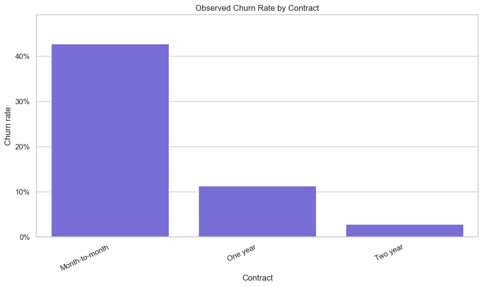
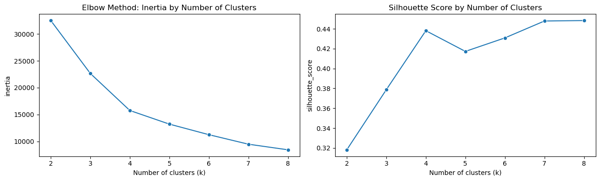
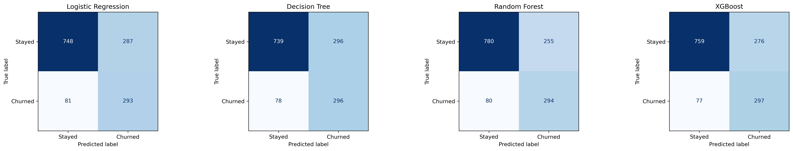
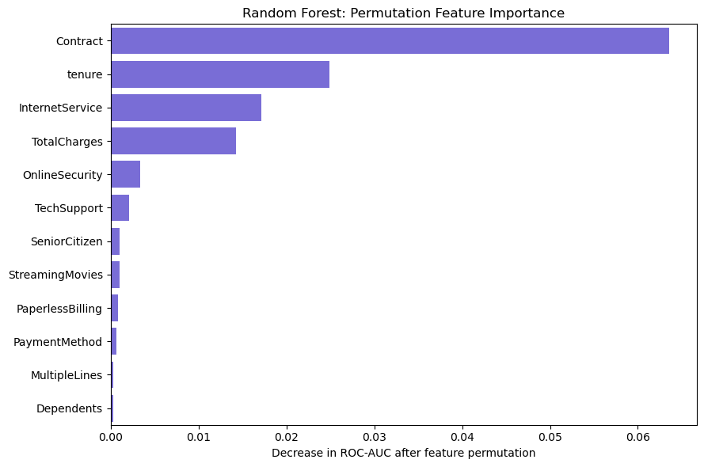

# Telecom Customer Churn Prediction & Customer Segmentation

An end-to-end telecom analytics and machine-learning project using the IBM Telco Customer Churn public benchmark dataset.

## Live demo

Try the interactive churn-prediction app:

[Open the Streamlit app](https://telecom-churn-predictor-altayeb.streamlit.app/)

> This is a portfolio demonstration using a public benchmark dataset.

## Business objective

Identify churn patterns, segment customers into meaningful groups, and compare machine-learning models that could help a telecom retention team prioritize outreach.

## Interactive Streamlit app

The Streamlit app uses the selected Random Forest pipeline to estimate churn risk from customer account details.

It:

- Accepts customer profile, billing, contract, and service information.
- Recreates the engineered features used during model training.
- Displays predicted churn probability and a churn classification.
- Provides candidate retention actions based on observed project patterns.

### Run locally

```bash
pip install -r requirements.txt
streamlit run app.py
```

Predictions are model estimates, not guarantees.

## Dataset

- Source: [IBM Telco Customer Churn dataset on Kaggle](https://www.kaggle.com/datasets/blastchar/telco-customer-churn)
- Records: 7,043 customers
- Variables: 21 original columns
- Target: `Churn` (`Yes` / `No`)

## Project workflow

1. Data understanding and quality checks
2. Exploratory data analysis
3. Feature engineering
4. Customer segmentation with K-means
5. Churn-model comparison
6. Model interpretation and retention recommendations
7. Streamlit deployment

## Key findings

- Overall observed churn rate: **26.5%**.
- Customers with 0–12 months of tenure had a **47.44%** observed churn rate, compared with **9.51%** for customers with 49–72 months of tenure.
- Month-to-month customers had a **42.71%** observed churn rate, versus **11.27%** for one-year and **2.83%** for two-year contracts.
- Fiber-optic customers had a **41.89%** observed churn rate.
- Customers without tech support had a **41.64%** observed churn rate.

These are descriptive associations, not causal conclusions.



## Customer segmentation

K-means clustering was evaluated across 2–8 clusters. Four clusters were selected based on the elbow method, a silhouette score of **0.4381**, and business interpretability.

| Segment                                   | Customer share | Observed churn rate | Summary                                                                                                      |
| ----------------------------------------- | -------------: | ------------------: | ------------------------------------------------------------------------------------------------------------ |
| High-risk new internet customers          |         39.34% |              46.01% | Short tenure, predominantly month-to-month, frequent electronic-check use, and limited tech-support adoption |
| Mid-tenure DSL customers                  |          9.68% |              24.93% | DSL-only customers with moderate churn risk                                                                  |
| Basic non-internet customers              |         21.67% |               7.40% | Low-charge customers without internet or add-on services                                                     |
| Established high-value internet customers |         29.31% |              15.07% | Long-tenure, high-charge, high-service-adoption customers                                                    |



## Churn prediction

The data was split into stratified training (80%) and held-out test (20%) sets. Logistic Regression, Decision Tree, Random Forest, and XGBoost were evaluated using the same features, preprocessing approach, and evaluation metrics.

| Model               | Precision |    Recall |  F1-score |   ROC-AUC |
| ------------------- | --------: | --------: | --------: | --------: |
| Random Forest       | **0.536** |     0.786 | **0.637** |     0.839 |
| XGBoost             |     0.518 | **0.794** |     0.627 | **0.845** |
| Logistic Regression |     0.505 |     0.783 |     0.614 |     0.842 |
| Decision Tree       |     0.500 |     0.791 |     0.613 |     0.833 |

### Final model decision

Random Forest remains the selected and deployed model because it achieved the highest F1-score and precision, providing the best overall precision-recall balance under this project's selection criterion.

XGBoost achieved the highest ROC-AUC and recall, but its lower precision and F1-score did not justify replacing the tested Random Forest deployment.



## Model interpretation

Permutation importance identified these leading predictive features:

1. Contract type
2. Tenure
3. Internet service
4. Total charges

Feature importance measures predictive contribution within the selected Random Forest model; it does not establish causality.



## Retention recommendations

- Prioritize onboarding and proactive support for early-lifecycle customers.
- Test targeted retention actions for high-risk, month-to-month internet customers.
- Investigate fiber-optic churn through service-quality, complaint, and price-perception data not available in this dataset.
- Protect high-value, long-tenure customers through proactive service and loyalty initiatives.
- Test campaigns with control groups before claiming retention or revenue impact.

## Repository structure

```text
├── models/
│   └── random_forest_churn_pipeline.joblib
├── notebooks/
│   ├── 01_data_understanding.ipynb
│   ├── 02_feature_engineering.ipynb
│   ├── 03_customer_segmentation.ipynb
│   └── 04_churn_prediction.ipynb
├── reports/
│   └── figures/
├── app.py
├── README.md
├── requirements.txt
└── .gitignore
```

## How to run the analysis

```bash
pip install -r requirements.txt
jupyter notebook
```

Run the notebooks in numerical order. Download the dataset and save it locally as:

```text
data/raw/WA_Fn-UseC_-Telco-Customer-Churn.csv
```

## Tech stack

Python, Pandas, NumPy, Matplotlib, Seaborn, scikit-learn, XGBoost, Streamlit, and Joblib.
